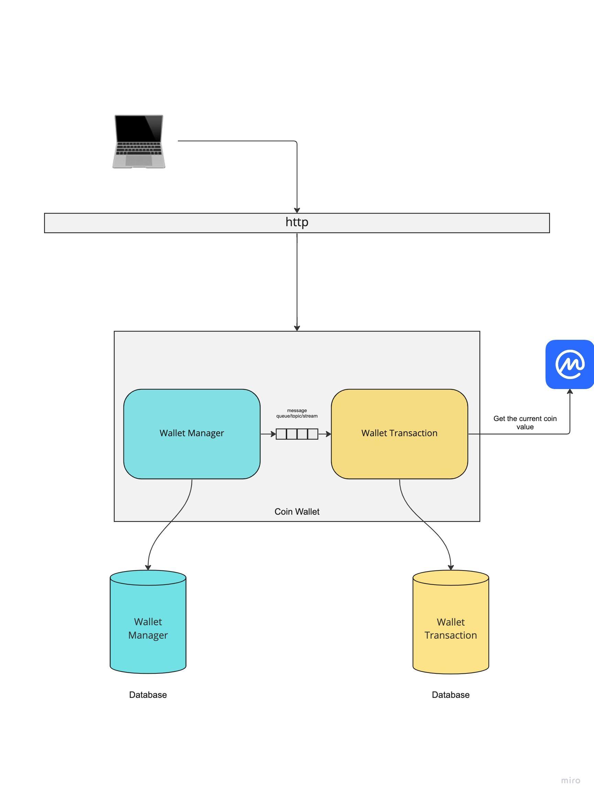
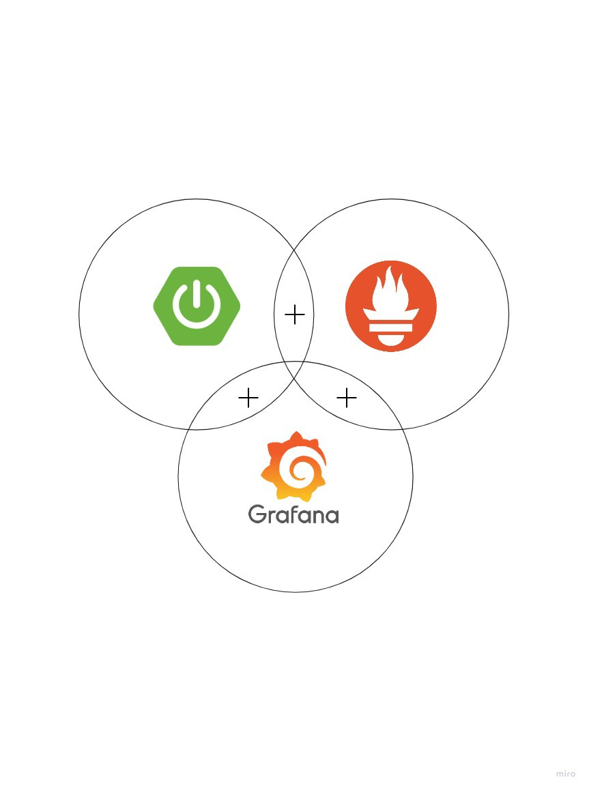

# Coin Wallet - Modular Monolith Application with database decoupled

## Context

This app is based on the book based do Newman, Sam. Building Microservices in chapter 1

This app is used as hands-on on many medium story 
 - [How to monitor Java applications — Springboot Actuator + Prometheus + Grafana](https://medium.com/@andrelucastic/how-to-monitor-java-applications-springboot-actuator-prometheus-grafana-da8d2c3c6d9a)
 
 - [From Monoliths to Microservices— Springboot Modular Monolith Application with database decoupled](https://medium.com/@andrelucastic/from-monoliths-to-microservices-springboot-modular-monolith-application-with-database-decoupled-42ac4ffa6377)

### Architecture Overview

### Tech Stack

- Springboot
- Podman & Podman Compose
- Java 17
- Prometheus
- Grafana
- PostgreSQL
- Flyway

### Monitoring Stack

To see the endpoint doc you can access
- http://localhost:9958/swagger-ui/index.html#/
